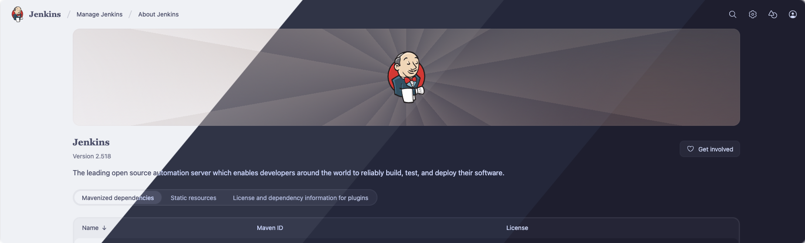

# Catppuccin Theme Plugin

## Introduction

This plugin provides the Catppuccin themes for Jenkins.

## Usage

After installing this plugin, go to _Manage Jenkins » Appearance » Themes_ and select one of the _Latte_, _Frappé_, _Macchiato_, _Mocha_ themes.

## Contributing

Refer to our [contribution guidelines](https://github.com/jenkinsci/.github/blob/master/CONTRIBUTING.md).

## LICENSE

Licensed under MIT, see [LICENSE](LICENSE.md).
